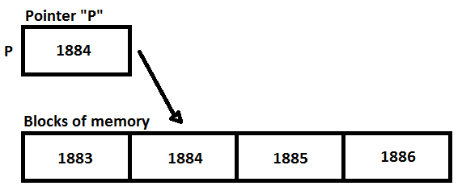

% Some Go Pointers
% Wayne Chang (wayne@wyc.io)
% June 21st, 2017


# The Pointer


In the year 2000, Harold Lawson was tried in International Court of Justice
"[f]or inventing the pointer variable and introducing this concept into PL/I,
thus providing for the first time, the capability to flexibly treat linked
lists in a general-purpose high level language."

# The Pointer


In the year 2000, Harold Lawson ~~was tried in International Court of Justice~~
was presented the IEEE Computer Pioneer Award "[f]or inventing the pointer
variable and introducing this concept into PL/I, thus providing for the first
time, the capability to flexibly treat linked lists in a general-purpose high
level language."

# The Pointer

A pointer is a value that can refer to a memory address.



# The Pointer
- It is commonly represented in C-like languages with an asterisk in the type: `*`
- Operators that ask variables for their addresses are represented with an
  ampersand: `&`
- Confusingly enough, the `*` symbol is also used as an operator to access the
  value at an address contained in a pointer.

```go
var a int = 5
var b *int = &a
*b = 1337
fmt.Println(a) // 1337
```

# The `new` Function

The `new` function allocates enough memory to fit a given type of value and returns a pointer to it.

```go
var b *int = new(int)
*b = 1337
fmt.Println(*b) // 1337
```


# Guiding Principle

**You wouldn't just give someone your home address unless you had a good reason, right? The same is a good guideline for pointer usage in go.**

# Some _Good_ Uses of Pointers in Go

- Performance (Sometimes. Excessive pointer usage is often poorly defended with this argument.)
- Expressive Method Receivers
- SMP (Concurrency)
- Complex Types
- Data Dependencies
- Sadism

# The performance argument

See `speed.go`.

- 64 kB struct passed a million times
    - passing the val: 2.389883463s
    - passing the ptr: 288.313µs
    - 2.4s/(1000000*64kB) = 0.0375µs/kB
    - HTTP request: 50 milliseconds
- 1-byte struct passed a million times
    - passing the val: 288.269µs
    - passing the ptr: 323.839µs

Takeaway: Only use pointers for performance when you are passing around very large data structures (kBs and up) very frequently. In many cases, using pointers for smaller structs can actually hinder performance by making the processor dereference and risk losing memory locality.

# Syntactic Magic

```go
type A struct {
	n int
}
func (a *A) purge() { a.n = 0 }
func (a A) printValue() { fmt.Println(a.n) }

func main() {
	a := A{n: 5}
	a.printValue() // 5
	a.purge()
	a.printValue() // 0

    pA := &A{n: 5}
    pA.printValue() // 5
    pA.purge()
    pA.printValue() // 0
}
```

# Expressive Method Receivers

> ...because pointer methods can modify the receiver; invoking them on a value
> would cause the method to receive a copy of the value, so any modifications
> would be discarded.

>> Effective Go

```go
type A struct {
	n int
}
func (a A) purge()     { a.n = 0 } // BROKEN
func main() {
	a := A{n: 5}
	a.printValue() // 5
	a.purge()
	a.printValue() // 5
}
```

# Expressive Method Receivers

Takeaways:

- Use a pointer method receiver when you intend on changing the struct's values
  or values that it points to.
- A value method receiver hints that nothing will happen to this struct, as
  you're passing a copy. However, if that struct contains pointers, then the
  wherever those pointers refer to is still at risk.

# SMP (Concurrency)

- Not really possible without pointers or concurrency primitives, such as message
  passing in Erlang.
- You must pass a mutex by its address so your goroutines refer to the same
  lock. When mutexes are passed by their value, each goroutine gets a separate,
  unrelated mutex!

```go
// golang.org/src/sync/mutex.go, Line 21
// A Mutex is a mutual exclusion lock.
type Mutex struct {
    state int32
    sema  uint32
}
```

# Complex Types

```go
// Doubly-Linked List
type IntNode struct {
    value int
    next, prev *IntNode
}

// B-Tree
type IntNode struct {
    value int
    children []*IntNode
}
```

# Data Dependencies

```go
type Person struct {
    Home *Home
    Name string
}

type Home struct {
    Address string
}

func main() {
    home := &Home{"100 Golang Way"}
    roommate1 := &Person{Home: home, Name: "Jeff"}
    roommate2 := &Person{Home: home, Name: "Joe"}
}
```

# Pointer Fail: nil to indicate failure

In Go, we use multiple values to indicate results:

```go
v, err := f()
if err != nil { handle() }
```

Do not return `nil` to indicate a failure:

```go
// NO
func f(id int) *Person {
    if p, ok := DB.get("person", id); ok {
        return p
    }
    return nil
}
```

This gives no information, and `nil` is often a valid return value.

# Pointer Fail: taking the address of a loop variable

```go
// NO
func maxId(a []int) int {
    var max *int
    for _, v := range a {
        if max == nil || v > *max {
            max = &v
        }
        fmt.Printf("%v ", max)
    }
    return *max
}
func main() { fmt.Println(maxId([]int{1, 3, 2})) }

// Output
0x1040a124 0x1040a124 0x1040a124 2
```

# Pointer Fail: pointer method receiver calls on non-addressable values

```go
type A struct {
    n int
}
func (a *A) purge() { a.n = 0 }
m := map[int]A{0: {5}}
m[0].purge()
// main.go:15: cannot call pointer method on m[0]
// main.go:15: cannot take the address of m[0]
```

Slices are okay. Their elements are addressable.
```go
m := []A{{5}}
m[0].purge()
```

# Pointer Fail: Pointer to slice greedily holding memory

```go
import "github.com/pkg/profile"

func dumbNewValue() *int {
    s := make([]int, 65536, 65536)
    s[0] = rand.Int()
    return &s[0]
}

func main() {
    defer profile.Start(profile.MemProfile).Stop()
    rvs := []int{}
    for i := 0; i < CYCLES; i++ {
        rvs = append(rvs, dumbNewValue())
    }
}
```

# Pointer Fail: Greedy slices, results of our experiment

```
CYCLES=100
$ go tool pprof --text mem.pprof
       flat  flat%   sum%        cum   cum%
    16.51MB   100%   100%    16.51MB   100%  [memory]
```

CYCLES=1000
```
$ go tool pprof --text mem.pprof
       flat  flat%   sum%        cum   cum%
   207.52MB   100%   100%   207.52MB   100%  [memory]
```

DON'T HOLD ON TO THE SLICE.

# Extra Credit/Fun Fact: Escape Analysis

- Go can tell at compile-time when pointers are going to leave the function via
  return value, as a parameter to another function, or as a global variable.

- If the memory will be accessed by a different function, then it is allocated
  on the heap instead of the stack.


# Remember

## Try not to use pointers if you don't have to.


# References

Slides: https://github.com/wyc/some-go-pointers

- [Pointers in Go](https://dave.cheney.net/2014/03/17/pointers-in-go)
- [Introduction to Go: Pointers](https://www.golang-book.com/books/intro/8)
- [Go Source Code: Mutexes](https://golang.org/src/sync/mutex.go?s=650:697)
- [Effective Go: Pointers vs. Values](https://golang.org/doc/effective_go.html#pointers_vs_values)
- [Don't Get Bitten by Pointer vs Non-Pointer Method Receivers in Golang](https://nathanleclaire.com/blog/2014/08/09/dont-get-bitten-by-pointer-vs-non-pointer-method-receivers-in-golang/)
- [Go Slices: usage and internals](https://blog.golang.org/go-slices-usage-and-internals)

# EOF
